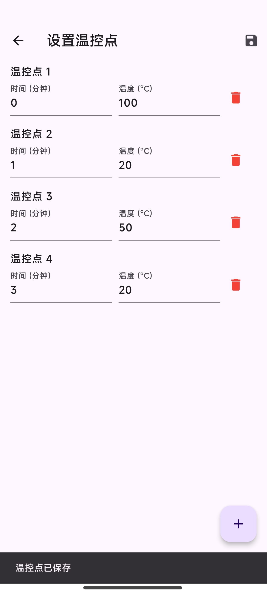
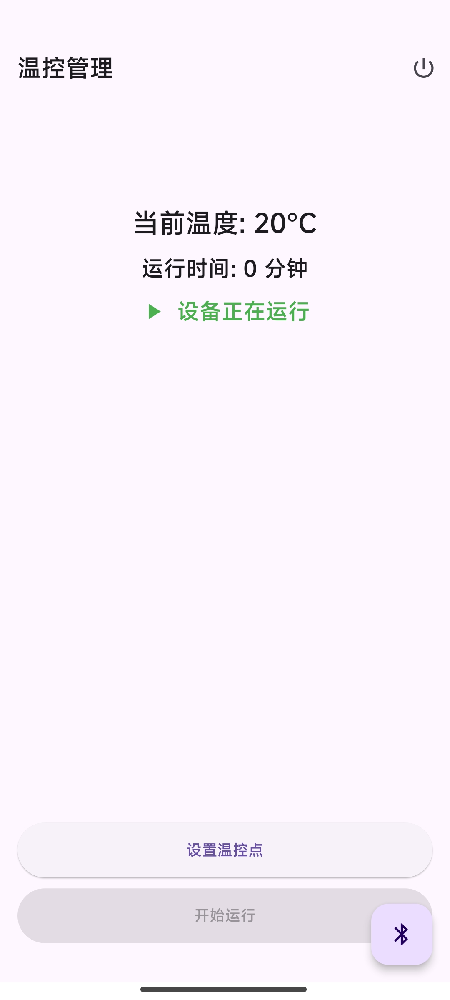

# bluetooth_temperature_control

  
  
  

这是一个基于 Flutter 框架开发的客户端，用于配合合宙的 ESP32-C3 来控制恒温箱的温控器，给其加上物联网功能，方便自动化温度控制。

本项目由学长的项目而来：https://github.com/LFF8888/TemperatureControl/ 
学长自己的代码的教程演示在 https://www.bilibili.com/video/BV1Kx421U7cX/

本项目基于 **MIT** 协议开源  

图标协议：https://github.com/Templarian/MaterialDesign/blob/master/LICENSE

嵌入式代码在：
https://github.com/SnowSwordScholar/ESP_BlueT_Temp_Conctol